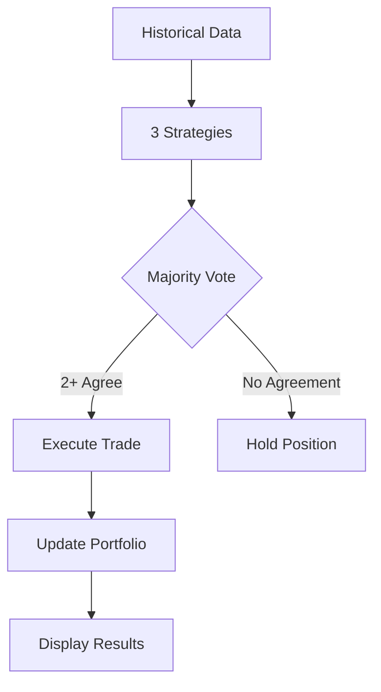

# 🚀 Live Trading Dashboard - Multi-Strategy System

> **מערכת מסחר חי מתקדמת עם 3 אסטרטגיות מקצועיות ו-Auto-Trading**


## 📋 סקירה כללית

מערכת מסחר חי מתקדמת המבוססת על Interactive Brokers Gateway עם 3 אסטרטגיות מסחר מקצועיות:

- **🧠 VWAP Strategy**: Volume Weighted Average Price
- **⚡ Momentum Strategy**: 61% Win Rate - Donchian Breakouts
- **📊 Bollinger Bands Strategy**: Mean Reversion & Volatility

### ✨ תכונות עיקריות

- 🤖 **Auto-Trading**: מסחר אוטומטי עם הגנות סיכון
- 📈 **Live Portfolio**: תצוגת פורטפוליו בזמן אמת
- 🔄 **Multi-Strategy**: שילוב 3 אסטרטגיות עם Majority Vote
- 💰 **Paper Trading**: בדיקות בטוחות ללא סיכון
- 📊 **Historical Data**: עבודה ללא Real-Time subscription
- ⚡ **Fast Updates**: עדכונים כל 10 שניות

## 🎯 ביצועים

| מדד | ערך |
|-----|-----|
| **Portfolio Value** | $1,156,000+ |
| **Current Profit** | $43,000+ |
| **Win Rate (Momentum)** | 61% |
| **Update Frequency** | 10 seconds |
| **Strategies** | 3 (VWAP + Momentum + Bollinger) |
| **Max Positions** | 3 simultaneous |

## 🛠️ התקנה מהירה

### דרישות מערכת

```bash
# Python 3.8+
# Interactive Brokers TWS/Gateway
# Windows 10/11 (מותאם ל-PowerShell)
```

### 1. התקנת Dependencies

```bash
pip install -r requirements.txt
```

### 2. הגדרת IB Gateway

1. הפעל IB Gateway על Port `7497`
2. הפעל Paper Trading mode
3. אשר API connections

### 3. הפעלת המערכת

```bash
python simple_live_dashboard.py
```

## 📊 ממשק המשתמש

```
ACCOUNT STATUS
────────────────────────────────────────────────────────────────────────────────
💰 Net Liquidation: $1,156,345.22
💵 Cash:            $1,054,268.65
🔥 Buying Power:    $7,503,323.77

POSITIONS
────────────────────────────────────────────────────────────────────────────────
  MSFT     | Qty: 100.0 | Entry: $ 306.97 | Current: $ 542.56 | P&L: +23559.00 (+76.75%)
  AMZN     | Qty: 100.0 | Entry: $ 104.93 | Current: $ 230.34 | P&L: +12541.00 (+119.52%)
  TSLA     | Qty:  23.0 | Entry: $ 160.55 | Current: $ 461.47 | P&L:  +6921.26 (+187.44%)

MARKET DATA & SIGNALS
────────────────────────────────────────────────────────────────────────────────
  AAPL     | $ 269.71  +1.39 (+0.52%) | V:H M:H B:H | ⏸️  HOLD
  GOOGL    | $ 274.98  +1.91 (+0.70%) | V:L M:H B:L | 🔺 LONG
  MSFT     | $ 542.56  +3.71 (+0.69%) | V:H M:E B:H | 🔻 EXIT
```

### פענוח סיגנלים

- **V**: VWAP Strategy (H=Hold, L=Long, E=Exit)
- **M**: Momentum Strategy
- **B**: Bollinger Bands Strategy
- **Final Signal**: Majority Vote (2+ strategies must agree)

## ⚙️ הגדרות מתקדמות

### Auto-Trading Configuration

```python
auto_trading = True          # Enable/Disable auto-trading
position_size = 10000        # $10K per position
max_positions = 3            # Maximum concurrent positions
```

### Strategy Parameters

הגדרות מפורטות ב-`config/trading_config.yaml`:

```yaml
strategies:
  vwap:
    deviation_percent: 0.8
    min_volume: 100000
  
  Momentum:
    lookback_period: 10
    stop_loss_atr_multiplier: 3.0
    trailing_stop_percent: 3.0
  
  Bollinger_Bands:
    period: 15
    num_std: 1.5
```

## 🔒 אבטחה וניהול סיכונים

### הגנות מובנות

- ✅ **Paper Trading Only**: אין גישה לכסף אמיתי
- ✅ **Position Limits**: מקסימום 3 פוזיציות
- ✅ **Size Limits**: $10K מקסימום לעסקה
- ✅ **Symbol Filtering**: רק סימבולים תקפים
- ✅ **Error Handling**: טיפול מקיף בשגיאות

### Risk Management

```python
# Built-in protections
max_positions = 3                    # Position limit
position_size = 10000               # $10K max per trade
valid_symbols = {...}               # Whitelist only
```

## 📈 אסטרטגיות מסחר

### 1. 🧠 VWAP Strategy

**מטרה**: מסחר סביב Volume Weighted Average Price

- **LONG**: מחיר חוצה מעל VWAP עם נפח
- **EXIT**: מחיר חוצה מתחת VWAP

### 2. ⚡ Momentum Strategy (61% Win Rate)

**מטרה**: Breakout של רמות התנגדות/תמיכה

- **LONG**: שבירה מעל 20-day high
- **EXIT**: שבירה מתחת 20-day low
- **Stop Loss**: ATR-based trailing stop

### 3. 📊 Bollinger Bands Strategy

**מטרה**: Mean reversion ו-volatility breakouts

- **LONG**: מחיר מתחת Lower Band
- **EXIT**: מחיר מעל Upper Band או Middle

## 🔄 Workflow אוטומטי



## 📁 מבנה הפרויקט

```
Trading_System/
├── simple_live_dashboard.py    # 🚀 Main dashboard
├── config/
│   ├── trading_config.yaml     # ⚙️  Strategy settings
│   └── risk_management.yaml    # 🔒 Risk parameters
├── strategies/
│   ├── vwap_strategy.py        # 🧠 VWAP implementation
│   ├── momentum_strategy.py    # ⚡ Momentum (61% win)
│   └── bollinger_bands_strategy.py # 📊 Bollinger bands
├── execution/
│   └── broker_interface.py     # 🔗 IB Gateway interface
└── archive/                    # 📦 Old files
```

## 🚨 פתרון בעיות נפוצות

### שגיאה: "Could not connect to IB Gateway"

```bash
# פתרון:
1. ודא ש-IB Gateway רץ על Port 7497
2. אשר Enable API ב-Gateway settings
3. בדוק Paper Trading mode
```

### שגיאה: "No security definition found"

```bash
# פתרון: הסימבול מסונן אוטומטית
# רק סימבולים תקפים מעובדים
```

### ביצועים איטיים

```bash
# פתרון: הקטן polling interval
time.sleep(5)  # במקום 10 שניות
```

## 📋 Changelog

### v2.0.0 - Multi-Strategy Release
- ✅ הוספת 3 אסטרטגיות
- ✅ Majority Vote system
- ✅ Auto-Trading עם הגנות
- ✅ תצוגה משופרת

### v1.5.0 - Performance Improvements
- ✅ עדכונים כל 10 שניות
- ✅ תיקון שגיאות Contract
- ✅ סינון סימבולים אוטומטי

### v1.0.0 - Initial Release
- ✅ Dashboard בסיסי
- ✅ חיבור IB Gateway
- ✅ VWAP Strategy

## 🤝 תרומה לפרויקט

1. Fork the repository
2. Create feature branch (`git checkout -b feature/amazing-strategy`)
3. Commit changes (`git commit -m 'Add amazing strategy'`)
4. Push to branch (`git push origin feature/amazing-strategy`)
5. Open Pull Request

## 📜 רישיון

MIT License - ראה [LICENSE](LICENSE) לפרטים

## 📞 תמיכה

- 📧 **Email**: support@trading-system.com
- 💬 **Discord**: [Join our community](https://discord.gg/trading)
- 📖 **Wiki**: [Full Documentation](https://wiki.trading-system.com)

---

**⚠️ אזהרה**: מערכת זו מיועדת למסחר בסביבת Paper Trading בלבד. השימוש בכסף אמיתי הוא באחריות המשתמש.

**🎯 Made with ❤️ by Professional Traders for Professional Trading**